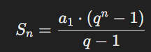

# Сумма Геометрической Прогрессии

Этот проект содержит скрипт на Python для вычисления суммы первых `n` членов геометрической прогрессии с использованием формулы:



где:
- `Sn` — сумма первых `n` членов,
- `a1` — первый член прогрессии,
- `q` — знаменатель (общий множитель) прогрессии,
- `n` — количество членов прогрессии.

## Использование

Для вычисления суммы просто вызовите функцию `geometric_series_sum(a1, q, n)` с необходимыми параметрами:

- `a1` — первый член прогрессии,
- `q` — знаменатель прогрессии,
- `n` — количество членов.

### Пример

```python
a1 = 2
q = 3
n = 5

sum_n = geometric_series_sum(a1, q, n)
print(f"Сумма первых {n} членов геометрической прогрессии: {sum_n}")
# 'Сумма первых 5 членов геометрической прогрессии: 242.0'
```
